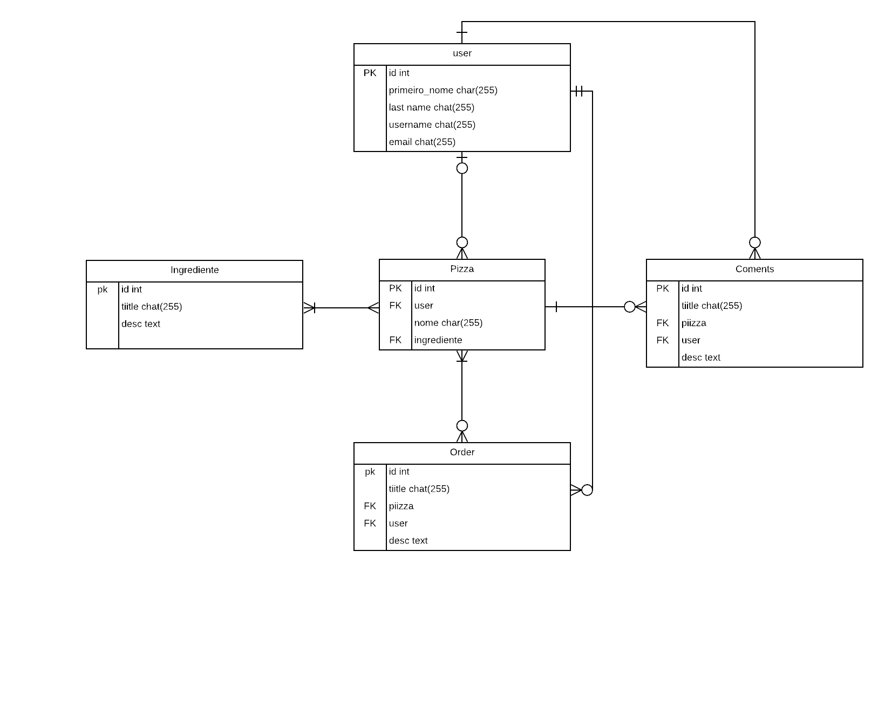

# Sistema Web Pizzaria

Esse é um sistema web contruído em **python/django**, é um desafio com o propósito de melhorar as habilidades em django.
O objetivo é desenvolver um sistema aonde o usuário possa se logar e realizar pedidos, consultar cardápios, ver históricos, comentar e ver comentários das pizzas.

## DER 

